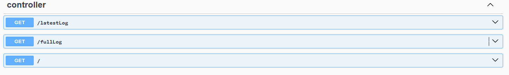
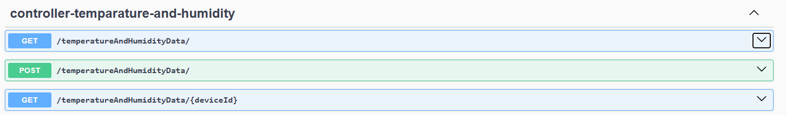
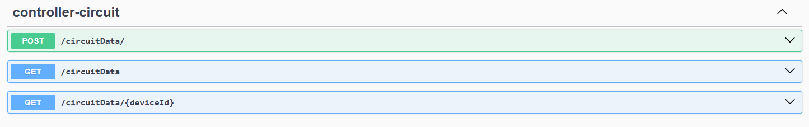
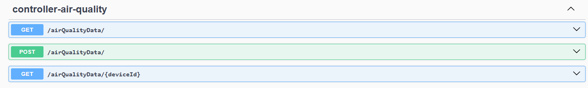
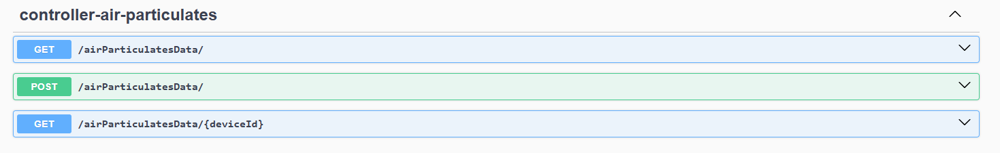
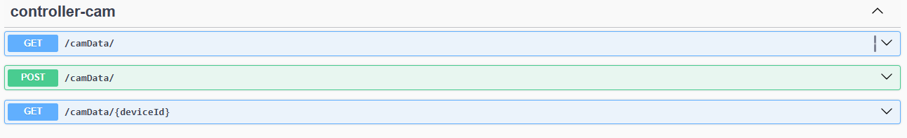
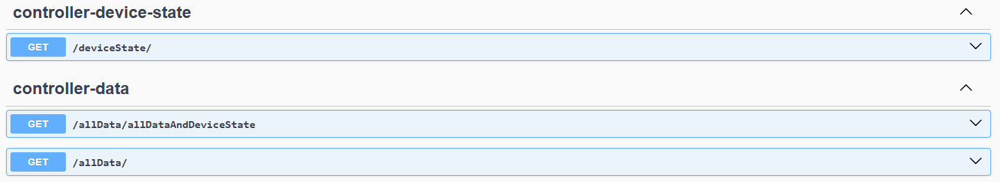
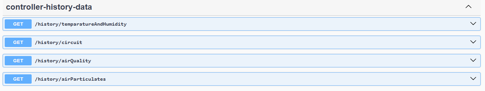
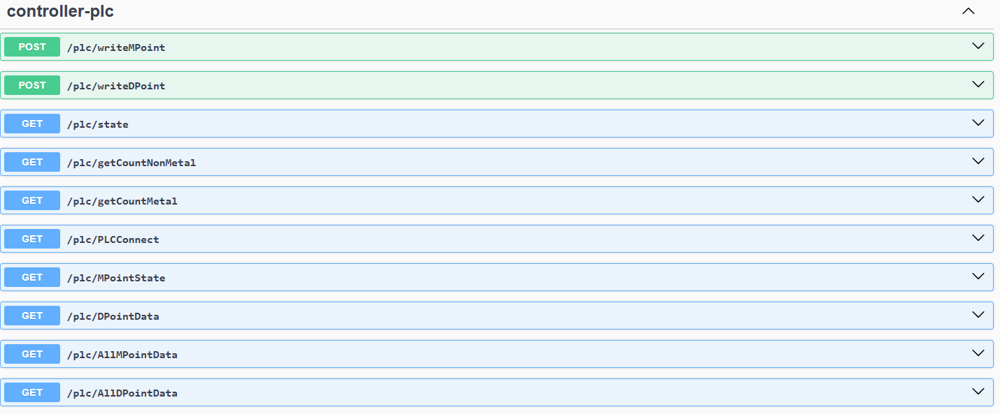
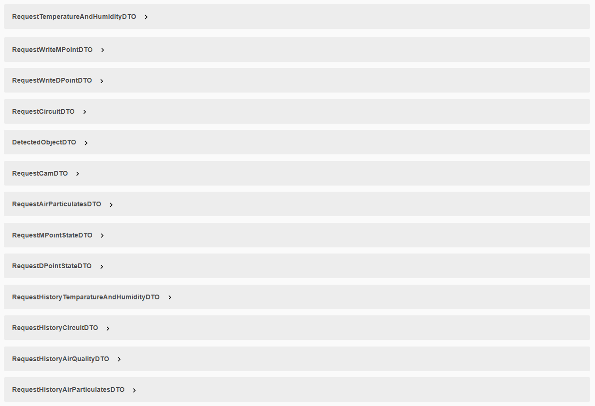

進入URL解釋
以下使用swagger-ui自動生成

請選擇以下章節進入
或直接造訪[這個靜態網頁](https://htmlpreview.github.io/?https://github.com/SilverTrust123/demoOnly/blob/main/Swagger%20UI.html)

[controller detail](https://github.com/SilverTrust123/demo/blob/main/doc/doc_controller/0.md)

[temparature and hudmidity detail](https://github.com/SilverTrust123/demo/blob/main/doc/doc_controller-temparature-and-humidity/0.md)

[circuit detail](https://github.com/SilverTrust123/demo/blob/main/doc/doc_controller-circuit/0.md)

[air quality detail](https://github.com/SilverTrust123/demo/blob/main/doc/doc_controller-air-quality/0.md)

[air particulates detail](https://github.com/SilverTrust123/demo/blob/main/doc/doc_controller-air-particulates/0.md)

[cam detail](https://github.com/SilverTrust123/demo/blob/main/doc/doc_cam/0.md)

[data and state detail](https://github.com/SilverTrust123/demo/blob/main/doc/doc_data_and_state/0.md)

[history detail](https://github.com/SilverTrust123/demo/blob/main/doc/doc_history/0.md)

[plc detail](https://github.com/SilverTrust123/demo/blob/main/doc/doc_plc/0.md)

DTO資料參考
/swagger-ui/index.html

<!-- [search DTO]() -->
